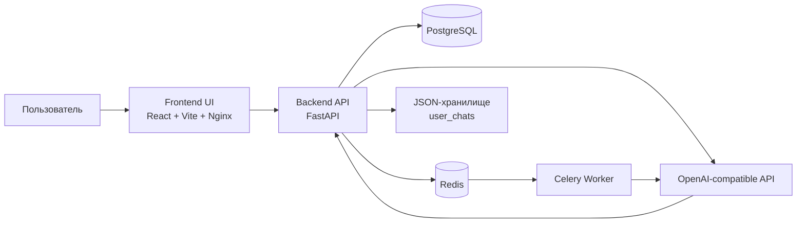

# Amnis

Amnis — веб-приложение для анализа сновидений с AI-ассистентом. Проект состоит из React/Vite frontend, FastAPI backend, PostgreSQL для пользовательских данных, Redis + Celery для фоновой обработки и собственного слоя интеграции с OpenAI-совместимым API.

Ниже описано, как проект устроен, что в нем происходит на каждом этапе, какие сервисы участвуют в обработке запросов, где лежат данные и какие ограничения есть у текущей реализации.

## 1. Что делает проект

Сценарий использования такой:

1. Пользователь открывает лендинг Amnis.
2. Регистрируется или входит по номеру телефона и паролю.
3. Создает чат для анализа сна.
4. Frontend отправляет сообщение на backend.
5. Backend обращается к OpenAI-совместимому API, получает потоковый ответ и возвращает его в интерфейс.
6. Дополнительно backend извлекает служебные триггеры из ответа модели:
   - переименование чата;
   - краткую сводку сна;
   - триггер предложения оплаты.
7. Метаданные чатов пишутся в PostgreSQL, а полная история сообщений хранится в JSON-файлах в `BACK/user_chats/`.
8. Профиль пользователя содержит количество доступных глубоких анализов и дату окончания подписки.

## 2. Общая архитектура



## 3. Структура репозитория

```text
.
├── BACK/                # FastAPI backend, Alembic, AI-интеграция, файлы чатов
├── UI/                  # React/Vite frontend
├── db-init/             # Инициализация PostgreSQL (сейчас каталог пустой)
├── Caddyfile            # Reverse proxy для доменов проекта и других сервисов
├── docker-compose.yml   # Оркестрация контейнеров
├── init_db.py           # Вспомогательный скрипт инициализации
├── package.json         # Корневой npm-манифест (фактически пустой)
└── README.md            # Этот файл
```

## 4. Backend: как он работает

### 4.1 Технологии

- FastAPI
- SQLAlchemy
- Alembic
- PostgreSQL
- Redis
- Celery
- python-jose / JWT
- passlib + bcrypt
- httpx

Основные зависимости перечислены в `BACK/requirements.txt`.

### 4.2 Точка входа

Основной HTTP-сервис запускается из `BACK/main.py`.

Во время старта создается объект `ai_chat_service`, который:

- создает каталог `user_chats`, если его нет;
- загружает системный промпт из `BACK/prompts/initial_prompt.txt`;
- инициализирует OpenAI-совместимый клиент по env-переменным.

Это значит, что backend зависит от БД и от корректной конфигурации AI-провайдера.

### 4.3 Основные модули backend

#### `BACK/main.py`

Содержит FastAPI-приложение и почти всю публичную API-логику:

- регистрация и вход;
- проверка JWT;
- профиль пользователя;
- смена пароля;
- пополнение анализов;
- создание и управление чатами;
- stream-ответы от ИИ;
- интеграция с Telegram-потоками;
- healthcheck.

#### `BACK/auth.py`

Отвечает за:

- хеширование паролей;
- проверку пароля;
- создание JWT;
- верификацию JWT.

#### `BACK/database.py`

Создает SQLAlchemy engine и `SessionLocal`, а также предоставляет dependency `get_db()` для FastAPI.

#### `BACK/models.py`

Определяет модели БД.

#### `BACK/ai_service.py`

Высокоуровневый сервис чатов. Именно он:

- создает новый чат;
- подставляет пользовательские данные в системный промпт;
- хранит JSON-состояние чатов;
- отправляет сообщения в OpenAI-совместимый endpoint;
- сохраняет краткую сводку сна и имя чата.

#### `BACK/openai_api.py`

Низкоуровневая интеграция с OpenAI-совместимым API:

- базовый URL `https://flick-api.gleeze.com/v1`;
- авторизация по `Bearer` API key;
- модель `qwen-3.5`;
- потоковая отправка через `/chat/completions`;
- stateless-режим, в котором весь контекст чата берется из локально сохраненной истории сообщений.

#### `BACK/celery_app.py`

Содержит Celery-приложение и задачу `process_message_task`, которая умеет обрабатывать сообщение пользователя вне HTTP-потока.

### 4.4 Модель данных

#### Таблица `users`

Хранит:

- `phone_number` — уникальный номер телефона;
- `name`;
- `birth_date`;
- `password_hash`;
- `is_active`;
- `available_analyses` — сколько платных анализов осталось;
- `subscription_expiry` — когда заканчивается доступ;
- `created_at`, `updated_at`.

#### Таблица `chats`

Хранит:

- `chat_id` — внешний идентификатор чата;
- `user_id`;
- `title`;
- `dream_summary` — короткая сводка сна;
- `is_active` — soft delete;
- `created_at`, `updated_at`.

#### Таблица `telegram_users`

Нужна для привязки Telegram-аккаунта к профилю:

- `telegram_id`;
- `username`, `first_name`, `last_name`;
- `phone_number`;
- `access_token`;
- `is_verified`.

### 4.5 Где и как хранятся данные

В проекте гибридная схема хранения.

#### В PostgreSQL лежат:

- пользователи;
- список чатов;
- названия чатов;
- счетчик анализов;
- срок действия подписки;
- краткие summary снов.

#### В файловой системе лежат:

- полная история сообщений каждого чата;
- указатель на текущий активный чат пользователя.

Формат хранения:

```text
BACK/user_chats/
└── {phone_number}/
    ├── current_chat.json
    ├── {chat_id_1}.json
    ├── {chat_id_2}.json
    └── ...
```

То есть БД хранит индекс и метаданные, а файлы JSON — полный контекст переписки.

### 4.6 Как создается новый чат

При вызове `POST /chat/create` backend:

1. Находит пользователя по JWT.
2. Берет последние анализы пользователя из БД.
3. Загружает системный промпт.
4. Подставляет в него значения:
   - имя пользователя;
   - дату рождения;
   - количество доступных анализов;
   - цену;
   - список прошлых summary.
5. Создает локальный chat state для нового диалога.
6. Пишет метаданные чата в БД.
7. Сохраняет состояние чата в JSON.
8. Сохраняет системный промпт как `system`-сообщение в историю чата.

### 4.7 Как отправляется сообщение

Есть два режима.

#### `POST /chat/send`

Сообщение ставится в очередь Celery, а клиент получает `task_id`. Затем можно опрашивать `GET /chat/task/{task_id}`.

#### `POST /chat/send-stream`

Backend сразу проксирует поток ответа через Server-Sent Events. Frontend читает ответ кусками и постепенно дорисовывает сообщение в чате. Так как API работает stateless, backend на каждом запросе отправляет накопленную историю сообщений текущего чата.

### 4.8 Специальные триггеры в ответах ИИ

Backend и frontend ожидают, что модель может вернуть служебные маркеры:

- `[NAME_CHANGE = "..."]` — новое имя чата;
- `[SYMBOLS = "..."]` — краткая сводка/символика сна;
- `[ACTION: TRIGGER_PAYMENT_ROBOKASSA]` — показать предложение оплаты.

Логика обработки распределена так:

- backend записывает `dream_summary` и обновляет название чата;
- frontend скрывает эти триггеры из видимого текста и реагирует на них в интерфейсе.

### 4.9 Основные API endpoints

#### Аутентификация

| Метод | URL | Назначение |
|---|---|---|
| POST | `/register` | регистрация через сайт |
| POST | `/login` | вход по номеру телефона и паролю |
| GET | `/verify-token` | проверка JWT |
| POST | `/change-password` | смена пароля |

#### Профиль и подписка

| Метод | URL | Назначение |
|---|---|---|
| GET | `/profile` | получить профиль |
| PUT | `/profile` | обновить имя и дату рождения |
| GET | `/subscription` | получить данные о подписке |
| POST | `/payment/success` | зачислить анализы и продлить срок |

#### Чаты

| Метод | URL | Назначение |
|---|---|---|
| POST | `/chat/create` | создать чат |
| POST | `/chat/send` | поставить сообщение в очередь |
| POST | `/chat/send-stream` | потоковый ответ ИИ |
| GET | `/chat/task/{task_id}` | статус фоновой задачи |
| POST | `/chat/clear` | очистить текущий чат |
| GET | `/chats` | список чатов пользователя |
| POST | `/chat/switch` | переключить активный чат |
| GET | `/chat/{chat_id}/messages` | получить историю сообщений |
| DELETE | `/chat/{chat_id}` | удалить чат логически |
| PUT | `/chat/{chat_id}/title` | переименовать чат |
| GET | `/initial-prompt` | получить системный промпт |

#### Telegram-интеграция

| Метод | URL | Назначение |
|---|---|---|
| POST | `/auth/register` | альтернативная регистрация |
| POST | `/auth/register/telegram` | регистрация пользователя из Telegram |
| POST | `/telegram/auth` | вход через Telegram |

#### Сервисные endpoint'ы

| Метод | URL | Назначение |
|---|---|---|
| GET | `/health` | healthcheck контейнера |

### 4.10 Миграции

Alembic-миграции лежат в `BACK/alembic/versions/`:

- `000_initial_users_table.py`
- `001_add_chat_model.py`
- `002_add_name_and_birth_date_to_users.py`
- `003_add_subscription_data_field.py`
- `004_add_dream_summary_to_chats.py`
- `005_add_available_analyses_to_users.py`

Скрипты `ensure_migrations.py`, `startup_with_retry.py` и `entrypoint.sh` пытаются аккуратно дождаться БД, прогнать миграции и только потом поднять API.

## 5. Frontend: как он работает

### 5.1 Технологии

- React 18
- TypeScript
- Vite
- Radix UI
- motion
- axios
- Tailwind CSS
- lucide-react

### 5.2 Главный поток приложения

Корневой компонент `UI/src/App.tsx` работает как простой переключатель представлений:

- `landing` — лендинг;
- `chat` — основной чат;
- `profile` — профиль пользователя.

Если пользователь аутентифицирован, приложение переводится в режим чата. Если нет — показывается лендинг и модалка авторизации.

### 5.3 Ключевые компоненты

#### `LandingView.tsx`

Маркетинговая стартовая страница:

- hero-секция;
- блок “Как это работает”; 
- преимущества продукта;
- блок тарифов;
- CTA на открытие авторизации.

#### `AuthModal.tsx`

Форма регистрации/входа:

- ввод телефона;
- пароль;
- имя и дата рождения при регистрации;
- локальная валидация;
- переход к модалке подтверждения телефона.

#### `ChatWindow.tsx`

Центральный экран приложения. Именно здесь находится логика:

- загрузки списка чатов;
- выбора текущего чата;
- создания нового чата;
- отправки сообщений;
- обработки stream-ответа;
- распознавания голосового ввода в браузере;
- отображения upsell-блоков и предупреждения об оплате.

#### `ProfileModal.tsx`

Показывает:

- имя;
- телефон;
- дату рождения;
- количество доступных анализов;
- смену пароля;
- выбор тарифного плана.

### 5.4 Контексты frontend

#### `AuthContext.tsx`

Хранит:

- `isAuthenticated`;
- `token`;
- `user`.

Также умеет:

- восстановить токен из `localStorage`;
- проверить токен через backend;
- загрузить профиль;
- выполнить logout.

#### `PaymentContext.tsx`

Очень легкий контекст, в котором хранится только статус оплаты:

- `pending`;
- `paid`;
- `cancelled`;
- `null`.

### 5.5 Клиенты API на frontend

#### `UI/src/services/api.ts`

Отвечает за:

- регистрацию;
- логин;
- проверку токена;
- профиль;
- подписку;
- смену пароля;
- зачисление анализов после оплаты.

#### `UI/src/services/chatApi.ts`

Отвечает за:

- создание чата;
- список чатов;
- переключение чатов;
- отправку сообщений;
- SSE-stream;
- удаление чата;
- переименование чата.

Оба клиента автоматически подставляют `Authorization: Bearer ...` из `localStorage`.

### 5.6 Что видит пользователь в чате

Интерфейс чата поддерживает:

- историю сообщений;
- боковую панель чатов;
- создание нового диалога;
- переименование и удаление чатов;
- автообновление заголовка чата из ответа ИИ;
- скрытие служебных триггеров из текста ответа;
- модальное предупреждение перед переходом к оплате.

## 6. Платежная логика

В текущем коде логика оплаты находится в двух местах:

- в `ProfileModal.tsx`;
- в `RobokassaPaymentModal.tsx`.

По факту сейчас проект не показывает полноценную внешнюю интеграцию с реальной Robokassa. Текущая бизнес-логика выглядит так:

1. Пользователь выбирает план.
2. Frontend вызывает `POST /payment/success`.
3. Backend просто увеличивает `available_analyses` и обновляет `subscription_expiry`.

То есть endpoint `payment/success` сейчас играет роль прикладного подтверждения оплаты, а не защищенного платежного webhook-процесса.

## 7. Интеграция с OpenAI-совместимым API

Проект работает через OpenAI-совместимый endpoint:

- endpoint: `https://flick-api.gleeze.com/v1`
- модель: `qwen-3.5`

### Как это устроено

1. Backend хранит системный промпт и историю сообщений локально в JSON-файле чата.
2. При отправке нового сообщения backend берет весь накопленный контекст текущего диалога.
3. Контекст отправляется в `POST /chat/completions` в формате OpenAI-compatible API.
4. Ответ читается потоково из SSE.
5. Итоговое сообщение сохраняется в локальную историю и частично в PostgreSQL как metadata.

## 8. Инфраструктура и деплой

### 8.1 Docker Compose

`docker-compose.yml` описывает сервисы:

- `db` — PostgreSQL 15;
- `redis` — Redis 7;
- `backend` — FastAPI + Celery worker в одном контейнере;
- `frontend` — статический frontend под nginx;
- `telebot` — Telegram-бот.

### 8.2 Как запускается backend в контейнере

Команда контейнера backend:

```sh
sh -c "celery -A celery_app worker --loglevel=info --concurrency=2 &
       python startup_with_retry.py"
```

То есть в одном контейнере одновременно живут:

- HTTP API;
- Celery worker.

### 8.3 Frontend в контейнере

Frontend собирается через Vite и отдается nginx'ом как статический сайт.

`nginx.conf` также содержит proxy-правила для части backend-роутов.

### 8.4 Caddy

`Caddyfile` содержит много доменов для разных проектов, но для Amnis важны эти записи:

- `amnis.jdh-team.ru` -> `127.0.0.1:3000`
- `api.jdh-team.ru` -> `127.0.0.1:8000`
- `redis.jdh-team.ru` -> `127.0.0.1:6379`

## 9. Локальный запуск

## 9.1 Через Docker Compose

Теоретически основной способ запуска — docker compose.

```sh
docker compose up --build
```

Но в текущем состоянии есть важное ограничение: compose-файл ожидает каталог `TELEGRAM/`, а в рабочем дереве этого каталога нет. Значит, compose в таком виде не поднимется полностью без правки или восстановления Telegram-сервиса.

## 9.2 Backend локально

Примерный сценарий:

```sh
cd BACK
python -m venv .venv
.venv\Scripts\activate
pip install -r requirements.txt
python startup_with_retry.py
```

Отдельно нужно запустить worker:

```sh
cd BACK
celery -A celery_app worker --loglevel=info --concurrency=2
```

Для запуска нужны:

- PostgreSQL;
- Redis;
- корректный `DATABASE_URL`;
- `OPENAI_BASE_URL`;
- `OPENAI_API_KEY`;
- `OPENAI_MODEL`.

## 9.3 Frontend локально

```sh
cd UI
npm install
npm run dev
```

По умолчанию Vite поднимается на `http://localhost:3000`.

## 10. Переменные окружения

По коду и compose-файлу проект использует такие ключи:

### Backend

- `DATABASE_URL`
- `SECRET_KEY`
- `ALGORITHM`
- `ACCESS_TOKEN_EXPIRE_MINUTES`
- `CELERY_BROKER_URL`
- `CELERY_RESULT_BACKEND`
- `PORT`
- `HOST`
- `RELOAD`
- `OPENAI_BASE_URL`
- `OPENAI_API_KEY`
- `OPENAI_MODEL`
- `OPENAI_TIMEOUT`
- `USER_DATA_DIR`

### Frontend

- `REACT_APP_API_URL`

## 11. Важные замечания по текущей реализации

Это не замечания “в теории”, а факты, которые видно по репозиторию.

### 11.1 В `docker-compose.yml` описан `telebot`, но каталога `TELEGRAM/` в репозитории нет

Это делает compose-описание неполным в текущем состоянии workspace.

### 11.2 `auth.py` использует захардкоженный `SECRET_KEY`

В `docker-compose.yml` и `.env` ключ передается через переменные окружения, но модуль `BACK/auth.py` сейчас использует строковый литерал:

```python
SECRET_KEY = "your-secret-key-change-this-in-production"
```

То есть реальный JWT-секрет в коде backend сейчас не читается из env.

### 11.3 Frontend использует `process.env.REACT_APP_API_URL` в Vite-приложении

Код написан в стиле Create React App, а не в стандартном стиле Vite (`import.meta.env.VITE_*`). Сейчас это частично компенсируется fallback-значением на production API, но для чистого локального окружения это важно учитывать.

### 11.4 Логика оплаты сейчас прикладная, а не полноценная платежная интеграция

`/payment/success` сразу зачисляет анализы. В репозитории нет полноценного подтвержденного backend-обработчика внешнего платежного провайдера с подписью webhook, верификацией суммы и защитой от повторов.

### 11.5 `db-init/` сейчас пустой

Каталог смонтирован в PostgreSQL-контейнер, но инициализирующих SQL-файлов в нем нет.

### 11.6 История чатов и runtime-данные лежат прямо в репозитории

Сейчас в `BACK/user_chats/` хранятся runtime-данные чатов. Для production-подхода это лучше выносить в отдельные volume/secret-хранилища.

## 12. Что важно понимать про проект в целом

Amnis — это не просто чат к модели. В текущей архитектуре это связка из четырех уровней:

1. Маркетинговый и пользовательский интерфейс на React.
2. Backend-слой с авторизацией, профилем, чатами и подпиской.
3. Гибридное хранение данных: PostgreSQL + JSON-файлы.
4. Интеграция с внешним OpenAI-совместимым AI endpoint через stateless chat completions API.

Именно эта комбинация определяет весь проект: frontend управляет UX, backend — бизнес-логикой, PostgreSQL — структурными данными, а OpenAI-совместимый endpoint — фактической генерацией анализа сна.